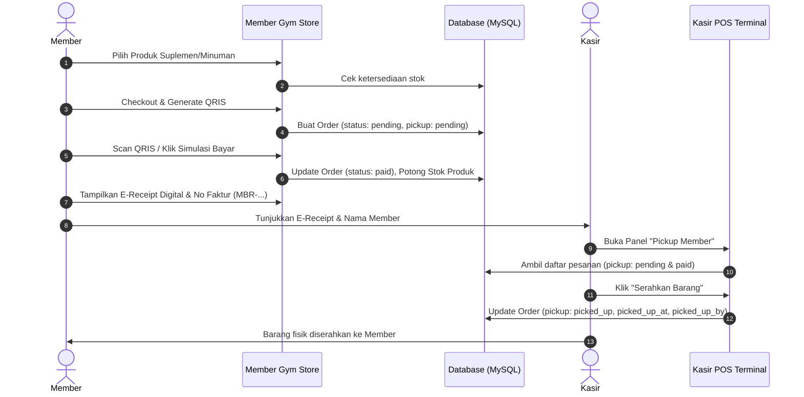
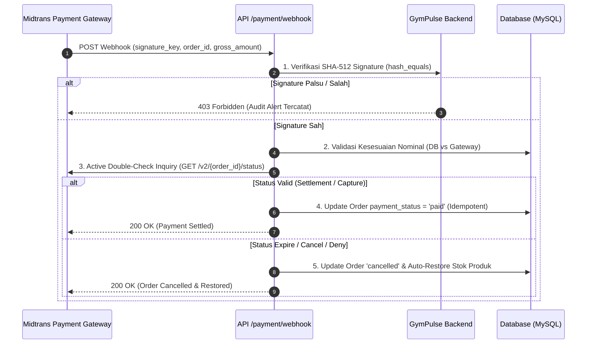

# 📋 README — Dokumentasi Perubahan & Penambahan Sistem (GymPulse)

Dokumen ini merangkum **seluruh penambahan fitur, optimalisasi sistem, perbaikan arsitektur, penguatan keamanan (security hardening), dan perbaikan bug** yang telah diimplementasikan pada aplikasi **GymPulse (Gym Membership & POS Kasir)**.

---

## 📑 Daftar Isi
1. [Ringkasan Pembaruan Utama](#-ringkasan-pembaruan-utama)
2. [Alur Arsitektur & Diagram Sistem](#-alur-arsitektur--diagram-sistem)
3. [Rincian Perubahan per Tahap Implementasi](#-rincian-perubahan-per-tahap-implementasi)
   - [Tahap 1–8: Foto Profil & Dasar RFID](#tahap-18--fitur-foto-profil-member--dasar-rfid)
   - [Tahap 9: Self-Service Store Member & QRIS](#tahap-9--self-service-member-gym-store--pembayaran-qris)
   - [Tahap 10: Panel Pickup & Serah Terima Kasir](#tahap-10--panel-pickup--serah-terima-pesanan-member-di-kasir)
   - [Tahap 11: E-Receipt / Struk Digital QR](#tahap-11--e-receipt--struk-pembayaran-digital-dengan-qr-code)
   - [Tahap 12: Fix Bug Blank Screen Kasir POS (Alpine.js)](#tahap-12--perbaikan-bug-blank-screen-katalog-kasir-pos-alpinejs)
   - [Tahap 13: Fix Kolom No. Faktur Riwayat Kasir](#tahap-13--perbaikan-kolom-no-faktur-kosong-pada-riwayat-shift-kasir)
   - [Tahap 14: Fix Jam Check-in Tertimpa Check-out (MySQL Schema)](#tahap-14--perbaikan-jam-check-in-tertimpa-jam-check-out-di-mysql)
   - [Tahap 15: Format Durasi Sesi Dinamis (Detik, Menit, Jam)](#tahap-15--format-durasi-sesi-presensi-dinamis-detik-menit-jam)
   - [Tahap 16: Penguatan Keamanan Payment Gateway & QRIS (Anti-Retas & Anti-Tukar)](#tahap-16--penguatan-keamanan-payment-gateway--qris-anti-retas--anti-tukar)
4. [Matriks Perubahan Database & Migrasi](#-matriks-perubahan-database--migrasi)
5. [Spesifikasi API Endpoint RFID Presensi & Webhook](#-spesifikasi-api-endpoint-rfid-presensi--webhook)
6. [Matriks Seluruh File (Baru vs Diubah)](#-matriks-seluruh-file-baru-vs-diubah)
7. [Panduan Pengujian Sistem & Demo Akun](#-panduan-pengujian-sistem--demo-akun)

---

## 🌟 Ringkasan Pembaruan Utama

| No | Modul / Fitur | Deskripsi Singkat | Status |
|:---:|:---|:---|:---:|
| 1 | **Self-Service Gym Store Member** | Member dapat membeli suplemen/minuman langsung dari HP dengan pembayaran QRIS dinamis yang otomatis memotong stok kasir. | ✅ Selesai |
| 2 | **Panel Pickup Kasir** | Antrean pesanan QRIS member di kasir untuk persiapan barang & serah terima dengan verifikasi no faktur. | ✅ Selesai |
| 3 | **E-Receipt Digital** | Bukti bayar digital berdesain modern dilengkapi verifikasi QR Code & opsi cetak/PDF. | ✅ Selesai |
| 4 | **Refactoring Alpine.js POS** | Mengatasi bug blank screen pada kasir dengan memisahkan state JS dari inline HTML attribute. | ✅ Selesai |
| 5 | **Akurasi Faktur Kasir** | Menampilkan nomor faktur (`invoice_number`) dengan tepat pada riwayat shift transaksi kasir. | ✅ Selesai |
| 6 | **Presensi RFID Akurat & Debounce** | Memperbaiki skema MySQL agar jam check-in tidak tertimpa jam check-out, disertai debounce 3 detik. | ✅ Selesai |
| 7 | **Durasi Sesi Presensi Dinamis** | Durasi latihan ditampilkan otomatis dalam satuan **Detik**, **Menit**, dan **Jam** secara natural. | ✅ Selesai |
| 8 | **Payment Gateway & QRIS Hardening** | 8 Lapis keamanan (EMVCo CRC-16, Signature SHA-512, Active Inquiry, Anti-IDOR, Production Lockout, Rate Limiter). | ✅ Selesai |

---

## 🔄 Alur Arsitektur & Diagram Sistem

### 1. Alur Transaksi Self-Service QRIS Member & Pickup Kasir


### 2. Alur Keamanan Notifikasi Webhook Payment Gateway (Anti-Spoofing & Anti-Tampering)


---

## 🛠️ Rincian Perubahan per Tahap Implementasi

### Tahap 1–8 — Fitur Foto Profil Member & Dasar RFID
- **Upload Foto Profil**: Member dapat memperbarui foto profil langsung dari dashboard member (`/member/dashboard`).
- **Streaming Foto Aman (Anti Broken Image)**: Foto disajikan via route Laravel `GET /member/photo` dan `GET /admin/members/{member}/photo` tanpa bergantung pada symlink sistem operasi atau public storage permissions.
- **Deteksi Kartu RFID**: Penanganan status kartu tidak terdaftar (`unregistered`), kartu diblokir (`blocked`), dan member kedaluwarsa (`expired`).

---

### Tahap 9 — Self-Service Member Gym Store & Pembayaran QRIS
- Member dapat memesan suplemen, minuman, dan aksesoris gym mandiri dari smartphone mereka (`/member/store`).
- Sinkronisasi stok otomatis dengan kasir POS.
- Integrasi QRIS dinamis dengan polling status pembayaran otomatis.

---

### Tahap 10 — Panel Pickup & Serah Terima Pesanan Member di Kasir
- Kasir POS & Admin POS memiliki modal khusus antrean **📦 Pickup Member**.
- Pencarian berdasarkan nama member atau nomor invoice (`MBR-260907-XXXX`).
- Tombol **"Serahkan Barang"** mencatat waktu penyerahan (`picked_up_at`) dan nama kasir (`picked_up_by`).

---

### Tahap 11 — E-Receipt / Struk Pembayaran Digital dengan QR Code
- Struk digital resmi berdesain GymPulse Volt & Slate.
- Dilengkapi QR Code verifikasi, rincian produk, nomor faktur, dan tombol cetak struk/PDF.

---

### Tahap 12 — Perbaikan Bug Blank Screen Katalog Kasir POS (Alpine.js)
- Refactoring komponen state Alpine.js dari inline HTML attribute ke script mandiri (`cashierPosApp()` & `adminPosApp()`) terdaftar via `alpine:init`.

---

### Tahap 13 — Perbaikan Kolom No. Faktur Kosong pada Riwayat Shift Kasir
- Mengganti pemanggilan view dari `$o->order_number` menjadi `$o->invoice_number` agar nomor faktur tampil jelas.

---

### Tahap 14 — Perbaikan Jam Check-in Tertimpa Jam Check-out di MySQL
- Menghapus trigger `ON UPDATE CURRENT_TIMESTAMP` dari kolom `check_in_at` via migration.
- Menambahkan **Proteksi Debounce Double-Tap (3 Detik)** dan **Filter Sesi Hari Ini**.

---

### Tahap 15 — Format Durasi Sesi Presensi Dinamis (Detik, Menit, Jam)
- Menambahkan accessor `duration_formatted` pada model `Attendance`:
  - < 1 menit $\rightarrow$ `{x} Detik`.
  - < 1 jam $\rightarrow$ `{x} Menit {y} Detik`.
  - $\ge$ 1 jam $\rightarrow$ `{x} Jam {y} Menit {z} Detik`.
  - Status aktif $\rightarrow$ durasi berjalan real-time dengan label `(Berjalan)`.

---

### Tahap 16 — Penguatan Keamanan Payment Gateway & QRIS (Anti-Retas & Anti-Tukar)
**Tujuan:** Menutup seluruh celah keamanan transaksi keuangan agar QRIS tidak dapat dimanipulasi, ditukar dengan QR statis penyerang, dipotong harganya, atau dibobol via fake webhook.

1. **Integritas QRIS EMVCo & CRC-16 Checksum:**
   - Standar Bank Indonesia & EMVCo TLV dengan kalkulasi matematis CRC-16-CCITT (`0x1021`, initial `0xFFFF`) di tag `6304`.
   - Modifikasi 1 karakter QR string membatalkan checksum seketika.
2. **Verifikasi Tanda Tangan Kriptografis SHA-512 (Anti-Fake Webhook):**
   - Notifikasi Webhook divalidasi dengan mencocokkan SHA-512 signature menggunakan `ServerKey` rahasia dan timing-safe `hash_equals()`.
3. **Validasi Kesesuaian Nominal (Anti-Amount Tampering):**
   - Backend memverifikasi nominal `gross_amount` dari gateway sama persis dengan harga di database.
4. **Active Server-to-Server Double Verification:**
   - Server GymPulse melakukan query balik mandiri ke API Midtrans (`/v2/{order_id}/status`) sebelum mengubah status order.
5. **State Machine & Auto-Restore Stok:**
   - Idempotency proteksi transaksi berulang, serta auto-restore stok barang jika pesanan kedaluwarsa/batal.
6. **Kunci Sandbox di Mode Produksi:**
   - Tombol/endpoint simulasi bayar otomatis diblokir total (`403 Forbidden`) saat aplikasi beroperasi di server live produksi.
7. **Proteksi IDOR:**
   - Member hanya diizinkan mengakses transaksi miliknya sendiri.
8. **Rate Limiting:**
   - `throttle:webhook` (60 req/menit) dan `throttle:checkout` (15 req/menit).

---

## 🗄️ Matriks Perubahan Database & Migrasi

| File Migrasi | Tabel Terkait | Kolom yang Ditambahkan / Diubah | Keterangan |
|---|---|---|---|
| `2026_09_07_120000_add_pickup_columns_to_orders_table.php` | `orders` | `pickup_status` (`enum: pending, ready, picked_up`), `picked_up_at` (`timestamp`), `picked_up_by` (`foreignId`) | Pelacakan status serah terima barang pesanan member di kasir. |
| `2026_09_07_130000_fix_check_in_at_on_update_in_attendances_table.php` | `attendances` | `check_in_at` (`TIMESTAMP NOT NULL DEFAULT CURRENT_TIMESTAMP`) | Menghapus `ON UPDATE CURRENT_TIMESTAMP` agar waktu check-in tidak tertimpa saat check-out. Kompatibel SQLite & MySQL. |

---

## 📡 Spesifikasi API Endpoint RFID Presensi & Webhook

### 1. Check-In / Check-Out via UID
- **URL**: `POST http://127.0.0.1:8000/api/members/add` *(atau `POST /api/scan_uid`)*
- **Headers**: `Content-Type: application/json`
- **Request Body**: `{ "uid": "DEMO1234" }`

### 2. Notifikasi Webhook Payment Gateway (Midtrans)
- **URL**: `POST http://127.0.0.1:8000/api/payment/webhook` *(atau `/api/midtrans/notification`)*
- **Headers**: `Content-Type: application/json`
- **Keamanan**: Wajib menyertakan `signature_key` valid yang di-hash SHA-512 dengan `ServerKey`.

---

## 📁 Matriks Seluruh File (Baru vs Diubah)

| Path File | Status | Keterangan Perubahan |
|---|---|---|
| `app/Http/Controllers/Api/PaymentWebhookController.php` | **Baru** | Webhook handler aman dengan SHA-512 check, active inquiry, amount match, & auto-restore stock |
| `tests/Feature/PaymentSecurityTest.php` | **Baru** | Automated test suite untuk keamanan QRIS & Payment Gateway (7 skenario pengujian) |
| `app/Services/QrisService.php` | Diubah | Standar EMVCo CRC-16, HMAC-SHA256 signature generator, & Midtrans validator |
| `config/services.php` | Diubah | Konfigurasi resmi Payment Gateway Midtrans |
| `app/Providers/AppServiceProvider.php` | Diubah | Tambah rate limiter `webhook` dan `checkout` |
| `app/Http/Controllers/Member/StoreController.php` | Diubah | Katalog store, self-service QRIS checkout, lockout simulasi di production, IDOR check |
| `app/Http/Controllers/Cashier/PosController.php` | Diubah | Modal pickup member, serah terima barang, lockout simulasi di production |
| `app/Http/Controllers/Admin/PosController.php` | Diubah | Serah terima barang member, lockout simulasi di production |
| `resources/views/member/store/index.blade.php` | **Baru** | UI Gym Store mobile-first, QRIS dynamic modal, keranjang belanja |
| `resources/views/member/store/receipt.blade.php` | **Baru** | E-Receipt bukti pembayaran digital dengan QR verification |
| `database/migrations/2026_09_07_120000_...` | **Baru** | Migration kolom pickup pada tabel `orders` |
| `database/migrations/2026_09_07_130000_...` | **Baru** | Migration perbaikan kolom `check_in_at` pada tabel `attendances` |
| `app/Models/Attendance.php` | Diubah | Tambah accessor `getDurationFormattedAttribute()` & `$appends` |
| `app/Models/Order.php` | Diubah | Tambah fillable `pickup_status`, `picked_up_at`, `picked_up_by`, relasi `picker` |
| `app/Models/Product.php` | Diubah | Tambah accessor `image_url` untuk parsing foto produk lokal otomatis |
| `app/Http/Controllers/Api/MemberController.php` | Diubah | Fix checkin/checkout toggle, debounce 3 detik, date filter, akurasi JSON message |
| `app/Http/Controllers/Api/RfidScanController.php` | Diubah | Penyesuaian toggle checkin/checkout RFID reader |
| `resources/views/cashier/pos/index.blade.php` | Diubah | Refactoring Alpine.js ke script mandiri + modal pickup member |
| `resources/views/admin/pos/index.blade.php` | Diubah | Refactoring Alpine.js ke script mandiri + modal pickup member |
| `resources/views/cashier/orders/index.blade.php` | Diubah | Fix kolom No. Faktur (`invoice_number`) |
| `resources/views/cashier/attendance/index.blade.php` | Diubah | Tampilan Durasi Sesi dinamis (Jam, Menit, Detik) |
| `resources/views/admin/attendance/index.blade.php` | Diubah | Tampilan Jam Keluar & Durasi Sesi dinamis |
| `resources/views/layouts/member.blade.php` | Diubah | Tambah menu Gym Store di navbar dan mobile bar |
| `routes/web.php` | Diubah | Registrasi route `/member/store/*` & pembatasan `throttle:checkout` |
| `routes/api.php` | Diubah | Route webhook `/payment/webhook` dengan `throttle:webhook` & alias `/scan_uid` |
| `README-SECURITY.md` | Diubah | Panduan lengkap arsitektur keamanan & 8 lapis proteksi transaksi payment gateway |

---

## 🧪 Panduan Pengujian Sistem & Demo Akun

### 🔑 Kredensial Akun Pengujian

| Role | Email | Password | Keterangan |
|---|---|---|---|
| **Admin** | `admin@gym.test` | `password` | Akses penuh master data & laporan |
| **Kasir** | `kasir@gym.test` | `password` | Akses POS, Pickup Member, Riwayat Shift |
| **Member** | `budi@gym.test` | `password` | Member aktif (UID RFID: `DEMO1234`) |

---

### Menjalankan Seluruh Uji Otomatis Keamanan & Sistem:
```powershell
php artisan test
```
**Status Pengujian:** 12 Passed (36 assertions) ✅
