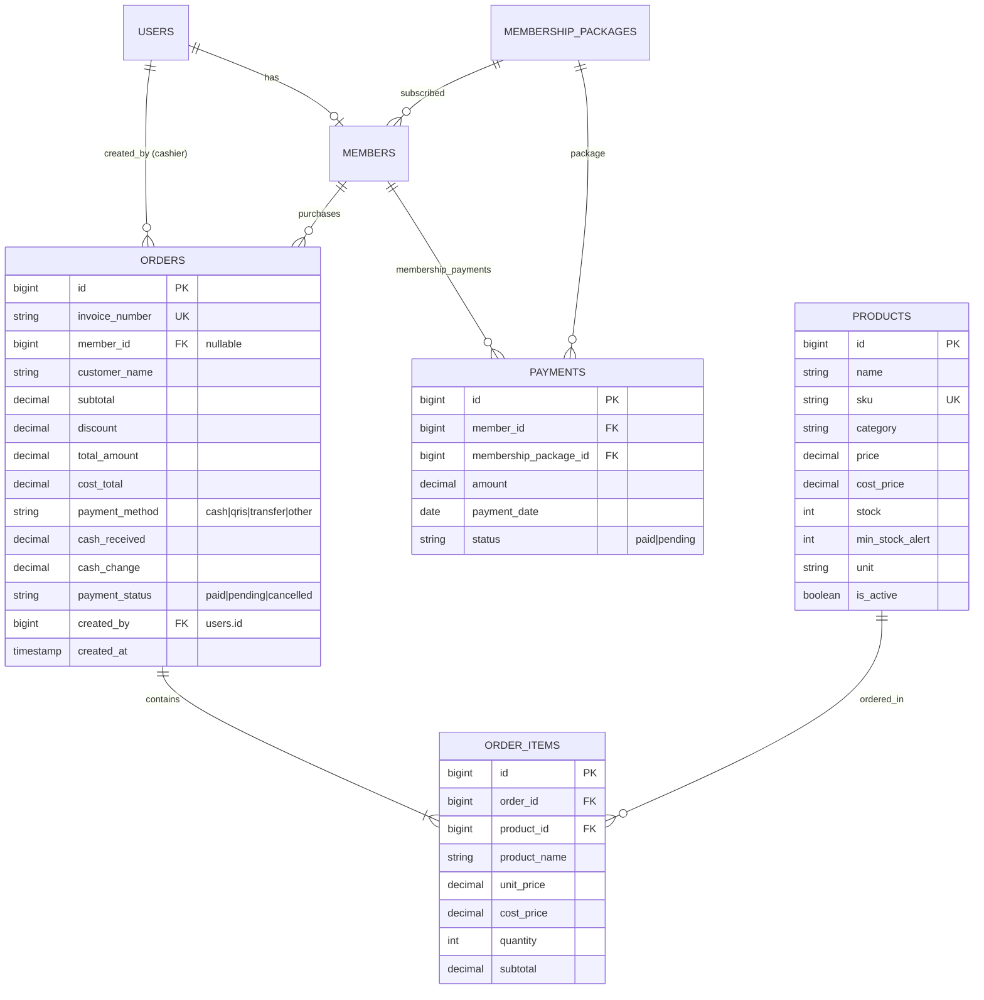

# 🏋️‍♂️ GymPulse — Smart RFID Gym Management & POS Payment System

Dokumentasi lengkap sistem manajemen keanggotaan gym modern berbasis **Laravel 11**, **Tailwind CSS**, dan **Alpine.js** yang terintegrasi dengan alat pembaca kartu **RFID Hardware (ESP32/ESP8266 + RC522)**, **WhatsApp Gateway (Fonnte)**, serta **Sistem Pembayaran & Point of Sale (POS) Gym Store Kasir**.

---

## 📑 Daftar Isi
1. [Ringkasan Pembaruan Sistem Pembayaran](#-ringkasan-pembaruan-sistem-pembayaran)
2. [Tabel Komparasi Perubahan (Sebelum vs Sesudah)](#-tabel-komparasi-perubahan-sebelum-vs-sesudah)
3. [Matriks File yang Diubah & Ditambah](#-matriks-file-yang-diubah--ditambah)
4. [Rincian Detail Pembaruan Fitur Pembayaran & POS](#-rincian-detail-pembaruan-fitur-pembayaran--pos)
5. [Skema Basis Data & Relasi Pembayaran](#-skema-basis-data--relasi-pembayaran)
6. [Tata Cara & Alur Penggunaan Sistem (SOP Pembayaran)](#-tata-cara--alur-penggunaan-sistem-sop-pembayaran)
7. [Panduan Instalasi & Menjalankan Aplikasi](#-panduan-instalasi--menjalankan-aplikasi)
8. [Kredensial Akun Demo](#-kredensial-akun-demo)
9. [Dokumentasi Integrasi Hardware RFID & WhatsApp](#-dokumentasi-integrasi-hardware-rfid--whatsapp)
10. [Struktur Rute Lengkap Aplikasi](#-struktur-rute-lengkap-aplikasi)
11. [Panduan Keamanan Sistem (README-SECURITY.md)](README-SECURITY.md)

---

## ⚡ Ringkasan Pembaruan Sistem Pembayaran

Sistem pembayaran telah ditingkatkan secara menyeluruh dari sekadar pencatatan manual paket membership menjadi **ekosistem transaksi gym modern serba otomatis**:

1. **Sistem Kasir Point of Sale (POS)**: Mendukung transaksi cepat penjualan suplemen, minuman dingin, snack, dan merchandise gym dengan keranjang interaktif, scan barcode/SKU, kalkulasi diskon, dan kembalian tunai otomatis.
2. **Multi Metode Pembayaran**: Mendukung **Tunai (Cash)**, **QRIS Dinamis (GoPay, OVO, BCA, Dana)**, dan **Transfer Bank (BCA & Mandiri)**.
3. **Perpanjangan Online Mandiri oleh Member (Self-Service)**: Member dapat memperpanjang paket membership langsung dari dashboard portal member menggunakan QRIS/Transfer dengan masa aktif otomatis bertambah seketika.
4. **Cetak Struk Thermal Siap Pakai**: Cetak struk belanja POS ukuran thermal 58mm/80mm serta E-Receipt bukti keanggotaan digital.
5. **Workstation Role Kasir (`cashier`)**: Panel khusus staf kasir front-desk yang langsung membuka halaman POS tanpa akses berlebih ke pengaturan inti admin.
6. **Laporan Finansial Komprehensif & Laba Toko**: Rekapitulasi pendapatan gabungan (Membership + Gym Store POS), penghitungan Harga Pokok Penjualan (HPP) vs Margin Profit, serta ekspor laporan PDF.
7. **Notifikasi WhatsApp Otomatis**: Pengiriman bukti perpanjangan dan aktivasi paket secara real-time via WhatsApp Gateway.

---

## 🔄 Tabel Komparasi Perubahan (Sebelum vs Sesudah)

| Modul / Fitur | Kondisi Sebelumnya (Lama) | Kondisi Terbaru (Sekarang) |
| :--- | :--- | :--- |
| **Transaksi Toko Gym (POS)** | Belum ada sistem penjualan barang/suplemen/minuman. | **Modul POS Lengkap**: Keranjang belanja interaktif, kalkulasi diskon, hitung uang tunai & kembalian, cetak struk nota POS (`/admin/pos` & `/cashier/pos`). |
| **Metode Pembayaran** | Hanya pembayaran tunai manual saat pendaftaran di admin. | **Multi-Metode Fleksibel**: Mendukung **Tunai (Cash)**, **QRIS Dinamis**, dan **Transfer Bank** lengkap dengan simulasi barcode & rekening resmi. |
| **Perpanjangan Membership** | Member harus konfirmasi manual via chat WhatsApp. | **Self-Service Online Renewal**: Member bisa pilih paket & metode bayar (QRIS/Transfer) di dashboard member (`/member/dashboard`), masa aktif langsung bertambah otomatis. |
| **Role & Akses Pengguna** | Hanya 2 role: `admin` dan `member`. | **3 Role Terstruktur**: Ditambahkan role `cashier` dengan workstation kasir mandiri (`/cashier`) untuk front desk. |
| **Katalog Produk & Stok** | Belum ada manajemen produk toko. | **Manajemen Produk Toko**: CRUD produk, kategori (*Supplements, Drinks, Snacks, Gear*), harga beli/modal, harga jual, sistem restock cepat, dan peringatan stok menipis. |
| **Katalog Toko Member** | Member tidak bisa melihat barang apa saja yang dijual di gym. | **Katalog Gym Store Member (`/member/store`)**: Member dapat melihat daftar suplemen, minuman, harga, stok, dan rekomendasi nutrisi. |
| **Struk & Bukti Bayar** | Hanya modal E-Receipt membership sederhana. | **Struk Kasir Thermal Print**: Format siap cetak nota printer thermal (58mm/80mm) + E-Receipt Keanggotaan PDF. |
| **Laporan Finansial** | Hanya laporan penerimaan paket membership. | **Laporan Keuangan Terpadu**: Rekap omzet membership + omzet toko POS, analisis laba kotor (*gross profit*), dan ekspor PDF laporan transaksi POS. |
| **Notifikasi WhatsApp** | Hanya registrasi, check-in, dan pengingat kadaluwarsa. | **Notifikasi Perpanjangan Baru**: Konfirmasi otomatis perpanjangan sukses beserta tanggal kedaluwarsa baru ke nomor WA member. |

---

## 📂 Matriks File yang Diubah & Ditambah

Berikut adalah daftar lengkap berkas yang **ditambahkan (BARU)** dan **dimodifikasi (DIUBAH)** terkait sistem pembayaran:

### 1. File Database & Migrasi (BARU)
- **[`database/migrations/2026_09_05_100000_create_products_table.php`](file:///c:/Users/user/gym-membership-app/database/migrations/2026_09_05_100000_create_products_table.php)** *(BARU)*:
  - Membuat tabel `products` (nama, SKU/barcode, kategori, harga jual, harga beli/modal, stok, min stock alert, satuan, deskripsi, status aktif).
- **[`database/migrations/2026_09_05_100001_create_orders_table.php`](file:///c:/Users/user/gym-membership-app/database/migrations/2026_09_05_100001_create_orders_table.php)** *(BARU)*:
  - Membuat tabel `orders` (invoice_number, member_id, customer_name, subtotal, discount, total_amount, cost_total, payment_method, cash_received, cash_change, payment_status, created_by) dan tabel `order_items` (order_id, product_id, product_name, unit_price, cost_price, quantity, subtotal).
- **[`database/migrations/2026_09_05_100002_add_cashier_to_roles_in_users_table.php`](file:///c:/Users/user/gym-membership-app/database/migrations/2026_09_05_100002_add_cashier_to_roles_in_users_table.php)** *(BARU)*:
  - Memperbarui kolom enum `role` pada tabel `users` untuk menyertakan hak akses `cashier`.
- **[`database/seeders/DatabaseSeeder.php`](file:///c:/Users/user/gym-membership-app/database/seeders/DatabaseSeeder.php)** *(DIUBAH)*:
  - Menambahkan akun demo kasir (`kasir@gym.test`) dan seeder 11 produk toko gym (Whey Protein, Creatine, Pre-Workout, Pocari Sweat, Hydro Coco, Shaker, Towel, dll).

### 2. File Model Eloquent (BARU & DIUBAH)
- **[`app/Models/Product.php`](file:///c:/Users/user/gym-membership-app/app/Models/Product.php)** *(BARU)*:
  - Model produk toko dengan relasi ke `order_items` dan atribut kalkulasi profit.
- **[`app/Models/Order.php`](file:///c:/Users/user/gym-membership-app/app/Models/Order.php)** *(BARU)*:
  - Model pesanan kasir dengan relasi ke `member`, `cashier` (User), `order_items`, serta helper label/icon metode pembayaran dan kalkulasi profit kotor.
- **[`app/Models/OrderItem.php`](file:///c:/Users/user/gym-membership-app/app/Models/OrderItem.php)** *(BARU)*:
  - Model item detail transaksi toko dengan relasi ke `order` dan `product`.
- **[`app/Models/User.php`](file:///c:/Users/user/gym-membership-app/app/Models/User.php)** *(DIUBAH)*:
  - Menambahkan helper method `isCashier()` dan relasi `orders()`.
- **[`app/Models/Payment.php`](file:///c:/Users/user/gym-membership-app/app/Models/Payment.php)** *(DIUBAH)*:
  - Penyesuaian relasi pencatatan pembayaran perpanjangan membership.

### 3. File Controller (BARU & DIUBAH)
- **[`app/Http/Controllers/Admin/PosController.php`](file:///c:/Users/user/gym-membership-app/app/Http/Controllers/Admin/PosController.php)** *(BARU)*:
  - Menangani tampilan POS kasir Admin, validasi transaksi stok (`lockForUpdate`), pembuatan invoice otomatis `POS-YYMMDD-XXXX`, kalkulasi kembalian, dan cetak struk nota.
- **[`app/Http/Controllers/Admin/ProductController.php`](file:///c:/Users/user/gym-membership-app/app/Http/Controllers/Admin/ProductController.php)** *(BARU)*:
  - Menangani katalog produk toko gym (CRUD), filter kategori, dan quick restock.
- **[`app/Http/Controllers/Admin/OrderController.php`](file:///c:/Users/user/gym-membership-app/app/Http/Controllers/Admin/OrderController.php)** *(BARU)*:
  - Menangani riwayat pesanan toko POS, detail transaksi, pencarian nota, dan pembatalan order.
- **[`app/Http/Controllers/Cashier/PosController.php`](file:///c:/Users/user/gym-membership-app/app/Http/Controllers/Cashier/PosController.php)** *(BARU)*:
  - Workstation POS khusus kasir front desk.
- **[`app/Http/Controllers/Cashier/MemberController.php`](file:///c:/Users/user/gym-membership-app/app/Http/Controllers/Cashier/MemberController.php)** *(BARU)*:
  - Fitur kasir untuk mendaftarkan member baru dan memproses perpanjangan paket langsung di front desk.
- **[`app/Http/Controllers/Cashier/OrderController.php`](file:///c:/Users/user/gym-membership-app/app/Http/Controllers/Cashier/OrderController.php)** *(BARU)*:
  - Riwayat transaksi kasir dan cetak ulang struk.
- **[`app/Http/Controllers/Cashier/AttendanceController.php`](file:///c:/Users/user/gym-membership-app/app/Http/Controllers/Cashier/AttendanceController.php)** *(BARU)*:
  - Riwayat dan absensi manual di meja kasir.
- **[`app/Http/Controllers/Member/DashboardController.php`](file:///c:/Users/user/gym-membership-app/app/Http/Controllers/Member/DashboardController.php)** *(DIUBAH)*:
  - Menambahkan method `renew()` untuk menangani pembayaran mandiri perpanjangan membership secara online dengan update masa aktif dan kirim notifikasi WhatsApp.
- **[`app/Http/Controllers/Member/StoreController.php`](file:///c:/Users/user/gym-membership-app/app/Http/Controllers/Member/StoreController.php)** *(BARU)*:
  - Menampilkan etalase produk Gym Store untuk member.
- **[`app/Http/Controllers/Admin/ReportController.php`](file:///c:/Users/user/gym-membership-app/app/Http/Controllers/Admin/ReportController.php)** *(DIUBAH)*:
  - Integrasi omzet POS toko, perhitungan laba kotor, dan ekspor PDF laporan transaksi toko (`ordersPdf`).
- **[`app/Http/Controllers/Admin/DashboardController.php`](file:///c:/Users/user/gym-membership-app/app/Http/Controllers/Admin/DashboardController.php)** *(DIUBAH)*:
  - Penambahan kartu statistik pendapatan POS dan ringkasan transaksi kasir hari ini.
- **[`app/Http/Controllers/Auth/LoginController.php`](file:///c:/Users/user/gym-membership-app/app/Http/Controllers/Auth/LoginController.php)** *(DIUBAH)*:
  - Penambahan logika redirect otomatis login berdasarkan role (Admin -> `/admin/dashboard`, Cashier -> `/cashier`, Member -> `/member/dashboard`).

### 4. File Layanan / Service (DIUBAH)
- **[`app/Services/WhatsAppService.php`](file:///c:/Users/user/gym-membership-app/app/Services/WhatsAppService.php)** *(DIUBAH)*:
  - Menambahkan fungsi `sendRenewalSuccess(Member $member)` untuk notifikasi WhatsApp konfirmasi perpanjangan keanggotaan berhasil.

### 5. File Tampilan / Views (BARU & DIUBAH)
- **[`resources/views/admin/pos/index.blade.php`](file:///c:/Users/user/gym-membership-app/resources/views/admin/pos/index.blade.php)** *(BARU)*:
  - Halaman kasir Point of Sale (POS) dengan katalog produk kartu, keranjang belanja interaktif (Alpine.js), modal kalkulator uang kembalian tunai, modal QRIS dinamis, dan modal transfer bank.
- **[`resources/views/admin/pos/receipt.blade.php`](file:///c:/Users/user/gym-membership-app/resources/views/admin/pos/receipt.blade.php)** *(BARU)*:
  - Layout struk nota kasir thermal print (58mm/80mm) dengan informasi nota, detail barang, subtotal, diskon, uang diterima, dan kembalian.
- **[`resources/views/admin/products/index.blade.php`](file:///c:/Users/user/gym-membership-app/resources/views/admin/products/index.blade.php)** *(BARU)*:
  - Manajemen produk toko, filter kategori, badge stok menipis, modal tambah/edit produk, dan modal restock cepat.
- **[`resources/views/admin/orders/index.blade.php`](file:///c:/Users/user/gym-membership-app/resources/views/admin/orders/index.blade.php)** *(BARU)*:
  - Tabel riwayat transaksi toko POS, filter tanggal, badge status bayar, modal rincian item nota, dan tombol cetak ulang struk.
- **[`resources/views/admin/reports/pdf/orders.blade.php`](file:///c:/Users/user/gym-membership-app/resources/views/admin/reports/pdf/orders.blade.php)** *(BARU)*:
  - Template PDF cetak laporan transaksi dan laba kotor penjualan POS.
- **[`resources/views/layouts/cashier.blade.php`](file:///c:/Users/user/gym-membership-app/resources/views/layouts/cashier.blade.php)** *(BARU)*:
  - Master layout khusus staf kasir front-desk.
- **[`resources/views/cashier/pos/index.blade.php`](file:///c:/Users/user/gym-membership-app/resources/views/cashier/pos/index.blade.php)** *(BARU)*:
  - Workstation POS kasir front desk yang responsif dan cepat.
- **[`resources/views/cashier/orders/index.blade.php`](file:///c:/Users/user/gym-membership-app/resources/views/cashier/orders/index.blade.php)** *(BARU)*:
  - Riwayat pesanan kasir dan cetak struk nota.
- **[`resources/views/cashier/members/index.blade.php`](file:///c:/Users/user/gym-membership-app/resources/views/cashier/members/index.blade.php)** & **[`create.blade.php`](file:///c:/Users/user/gym-membership-app/resources/views/cashier/members/create.blade.php)** *(BARU)*:
  - Pendaftaran member baru dan perpanjangan paket di meja kasir.
- **[`resources/views/cashier/attendance/index.blade.php`](file:///c:/Users/user/gym-membership-app/resources/views/cashier/attendance/index.blade.php)** *(BARU)*:
  - Pencatatan kehadiran absensi di workstation kasir.
- **[`resources/views/member/store/index.blade.php`](file:///c:/Users/user/gym-membership-app/resources/views/member/store/index.blade.php)** *(BARU)*:
  - Etalase katalog Gym Store untuk member.
- **[`resources/views/member/dashboard.blade.php`](file:///c:/Users/user/gym-membership-app/resources/views/member/dashboard.blade.php)** *(DIUBAH)*:
  - Ditambahkan tombol *"Perpanjang Online"*, modal pemilihan paket, modal pembayaran online QRIS & Transfer Bank, serta bukti invoice keanggotaan.
- **[`resources/views/admin/reports/index.blade.php`](file:///c:/Users/user/gym-membership-app/resources/views/admin/reports/index.blade.php)** *(DIUBAH)*:
  - Ditambahkan ringkasan omzet toko, laba bersih toko, grafik tren omzet vs laba toko 6 bulan, dan tombol ekspor PDF Laporan POS.
- **[`resources/views/layouts/admin.blade.php`](file:///c:/Users/user/gym-membership-app/resources/views/layouts/admin.blade.php)** *(DIUBAH)*:
  - Menambahkan menu navigasi sidebar: **Kasir (POS)**, **Produk Toko**, dan **Riwayat Transaksi**.
- **[`resources/views/layouts/member.blade.php`](file:///c:/Users/user/gym-membership-app/resources/views/layouts/member.blade.php)** *(DIUBAH)*:
  - Menambahkan menu navigasi **Gym Store**.

### 6. File Rute Aplikasi (DIUBAH)
- **[`routes/web.php`](file:///c:/Users/user/gym-membership-app/routes/web.php)** *(DIUBAH)*:
  - Mendaftarkan grup rute POS (`admin.pos.*`), Produk (`admin.products.*`), Pesanan (`admin.orders.*`), Workstation Kasir (`cashier.*`), dan Perpanjangan Member Online (`member.renew`, `member.store.index`).

---

## 💎 Rincian Detail Pembaruan Fitur Pembayaran & POS

### 1. Point of Sale (POS) Gym Store Kasir
- **Keranjang Belanja Real-time**: Menggunakan Alpine.js untuk menambah, mengurangi kuantitas, dan menghapus item tanpa reload halaman.
- **Pencarian Cepat & Filter Kategori**: Filter instan berdasarkan kategori (*Supplements, Drinks, Snacks, Gear*) dan pencarian nama produk / barcode SKU.
- **Pilihan Tipe Pembeli**:
  - *Tamu / Walk-in*: Tanpa perlu data akun member.
  - *Member Terdaftar*: Terintegrasi dengan database member gym untuk pelacakan transaksi pelanggan.
- **Kalkulasi Diskon & Pajak/Biaya**: Kolom diskon nominal dengan total akhir yang langsung ter-update otomatis.
- **Pencegahan Kehabisan Stok (Concurrency Safe)**: Menggunakan database row locking `lockForUpdate()` agar tidak terjadi *overselling* saat beberapa kasir bertransaksi bersamaan.

### 2. Multi-Metode Pembayaran Kasir & Member
- **💵 Tunai (Cash)**:
  - Input nominal uang yang diterima.
  - Tombol cepat nominal pas (*Uang Pas, 50.000, 100.000, 200.000*).
  - Validasi nominal tidak boleh kurang dari total belanja.
  - Kalkulasi uang kembalian secara real-time.
- **📱 QRIS Dinamis**:
  - Menampilkan QR Code NMID resmi GymPulse.
  - Mendukung semua aplikasi e-wallet & m-banking (GoPay, OVO, Dana, ShopeePay, BCA Mobile, Livin', dll).
  - Verifikasi pembayaran instan.
- **🏦 Transfer Bank**:
  - Rekening Bank BCA: `8271-9928-1120` (a.n. GymPulse Indonesia).
  - Rekening Bank Mandiri: `1370-0099-2811-2` (a.n. GymPulse Indonesia).
  - Salin nomor rekening 1-klik dan instruksi nominal pas.

### 3. Perpanjangan Membership Online Mandiri (Member Portal)
- Member dapat memperpanjang paket membership kapan saja dari `/member/dashboard`.
- Pilihan paket fleksibel (1 Bulan, 3 Bulan, 12 Bulan).
- Perhitungan masa aktif cerdas:
  - Jika paket masih aktif: Masa berlaku ditambahkan dari tanggal berakhir sebelumnya (`$member->expire_date->addMonths()`).
  - Jika paket sudah kedaluwarsa: Masa berlaku baru dihitung mulai dari hari transaksi pembayaran.
- Gerbang RFID gate otomatis aktif kembali setelah perpanjangan berhasil dikonfirmasi.
- Bukti pembayaran tercatat di sistem sebagai riwayat transaksi resmi.

### 4. Cetak Struk Nota POS & Bukti E-Receipt
- **Struk Kasir (Thermal Receipt)**:
  - Format nota berstandar printer kasir thermal (lebar 58mm / 80mm).
  - Otomatis memicu dialog cetak browser (`window.print()`).
  - Memuat nomor invoice unik (contoh: `POS-260905-0001`), waktu, kasir, item belanja, harga satuan, subtotal, diskon, metode bayar, uang diterima, dan kembalian.
- **E-Receipt Keanggotaan Member**:
  - Bukti digital keanggotaan yang dapat dicetak atau disimpan sebagai PDF kapan saja oleh member maupun admin.

### 5. Workstation Role Kasir Front-Desk (`cashier`)
- Role baru yang dibuat khusus untuk staf resepsionis gym.
- Saat login, kasir langsung diarahkan ke workstation POS (`/cashier`).
- Kasir dapat melayani penjualan toko, mendaftarkan member baru, melayani perpanjangan paket, dan mencatat absensi manual.
- Hak akses terlindungi sehingga kasir tidak dapat mengubah konfigurasi sensitif seperti paket harga admin atau menghapus data sistem.

### 6. Rekapitulasi Laporan Finansial & Margin Laba
- **Laporan Finansial Gabungan**: Dashboard admin dan halaman laporan menampilkan total pendapatan membership + total pendapatan toko POS.
- **Margin Laba Toko (Gross Profit)**: Menghitung secara otomatis selisih harga jual dengan modal HPP produk (`total_amount - cost_total`).
- **Grafik Tren Finansial 6 Bulan**: Visualisasi tren pendapatan membership vs omzet toko vs laba bersih toko.
- **Ekspor PDF Laporan POS**: Cetak laporan berkas PDF rekapitulasi penjualan per rentang tanggal tertentu.

---

## 🗄️ Skema Basis Data & Relasi Pembayaran



---

## 📖 Tata Cara & Alur Penggunaan Sistem (SOP Pembayaran)

### 1. SOP Transaksi Penjualan Kasir (Point of Sale)
1. Buka menu **Kasir (POS)** di Admin (`/admin/pos`) atau masuk sebagai Kasir (`/cashier`).
2. Klik produk pada katalog untuk menambahkannya ke keranjang belanja.
3. Sesuaikan jumlah (*Qty*) produk di sisi kanan panel.
4. *(Opsional)* Pilih nama member terdaftar jika pembeli adalah member gym, atau masukkan diskon jika ada promo.
5. Pilih metode pembayaran:
   - **Tunai**: Masukkan nominal uang yang diterima pembeli -> sistem menampilkan jumlah kembalian secara otomatis.
   - **QRIS**: Minta pelanggan memindai QR Code di layar.
   - **Transfer**: Minta pelanggan mentransfer ke rekening yang tertera.
6. Klik tombol **"Selesaikan Transaksi & Bayar"**.
7. Transaksi tersimpan, stok produk otomatis terpotong, dan layar struk nota thermal otomatis terbuka siap cetak.

### 2. SOP Member Melakukan Perpanjangan Paket Online (Self-Service)
1. Member login ke portal di `/login`.
2. Pada Dashboard Member (`/member/dashboard`), klik tombol **"⚡ Perpanjang Online"**.
3. Pilih paket keanggotaan yang diinginkan (Bulanan / 3 Bulan / Tahunan).
4. Pilih metode pembayaran: **QRIS Dinamis** atau **Transfer Bank**.
5. Lakukan pembayaran sesuai nominal yang tertera.
6. Klik tombol **"Konfirmasi Pembayaran"**.
7. Masa berlaku membership langsung bertambah, status menjadi aktif, kartu RFID gate langsung dapat digunakan kembali, dan konfirmasi WhatsApp terkirim ke nomor member.

### 3. SOP Pendaftaran & Pembayaran Member Baru di Front Desk
1. Staf Kasir membuka menu **Member** -> **+ Tambah Member Baru**.
2. Masukkan data member (Nama, No. WhatsApp, Email, dan Paket yang dipilih).
3. Tempelkan kartu RFID pada reader (UID terisi otomatis).
4. Klik **Simpan & Kirim Notifikasi WA**.
5. Sistem menyimpan data, mencatat pembayaran paket, mengaktifkan RFID, dan mengirim WhatsApp akun login ke member baru.

### 4. SOP Menambah Stok Produk Toko (Quick Restock)
1. Buka menu **Produk Toko** (`/admin/products`).
2. Klik tombol **"⚡ Restock"** pada produk yang stoknya menipis.
3. Masukkan jumlah unit barang masuk -> klik **"Simpan Penambahan Stok"**.
4. Stok produk langsung bertambah seketika dan status alert kembali normal.

---

## 🚀 Panduan Instalasi & Menjalankan Aplikasi

```bash
# 1. Masuk ke direktori proyek
cd gym-membership-app

# 2. Install dependensi composer
composer install

# 3. Setup file .env dan generate key
cp .env.example .env
php artisan key:generate

# 4. Sesuaikan konfigurasi database MySQL di .env
DB_DATABASE=gym_membership
DB_USERNAME=root
DB_PASSWORD=

# 5. Jalankan migrasi dan seeder data awal (termasuk produk toko & akun kasir)
php artisan migrate:fresh --seed

# 6. Install dependensi Node.js & compile aset Vite
npm install
npm run build

# 7. Jalankan server Laravel
php artisan serve
```

Akses aplikasi di browser: **`http://localhost:8000`**

---

## 🔑 Kredensial Akun Demo

| Role | Email | Password | Hak Akses Utama |
| :--- | :--- | :--- | :--- |
| **Administrator** | `admin@gym.test` | `password` | Akses penuh: POS Kasir, Produk Toko, Member, Paket, RFID, Laporan Finansial & WhatsApp |
| **Kasir Front Desk** | `kasir@gym.test` | `password` | Workstation Kasir: POS Penjualan Toko, Daftar Member Baru, Perpanjangan Paket, Struk Nota & Absensi |
| **Member Gym** | `budi@gym.test` | `password` | Portal Member: Kartu RFID Digital, Perpanjang Paket Online (QRIS/Transfer), E-Receipt & Toko Gym |

---

## 📡 Dokumentasi Integrasi Hardware RFID & WhatsApp

### 1. Endpoint Scan RFID Reader (ESP32 / ESP8266 + RC522)
Setiap kali kartu ditempelkan ke reader pintu masuk:

```http
POST /api/rfid/scan
Header: X-Device-Key: <RFID_DEVICE_KEY dari .env>
Content-Type: application/json

{
  "uid": "DEMO1234"
}
```

**Respon JSON Sukses:**
```json
{
  "status": "success",
  "message": "Check-in berhasil",
  "member_name": "Budi Santoso",
  "member_code": "GYM-2609-0001",
  "check_in_at": "07:12:03",
  "days_remaining": 20
}
```

### 2. Konfigurasi WhatsApp Gateway (Fonnte)
Tambahkan token provider pada file `.env`:
```env
WHATSAPP_API_URL=https://api.fonnte.com/send
WHATSAPP_API_TOKEN=isi_token_fonnte_anda
```

---

## 🗺️ Struktur Rute Lengkap Aplikasi

### 🌐 Rute Publik & Autentikasi
| Endpoint | Method | Name Rute | Middleware | Keterangan |
| :--- | :--- | :--- | :--- | :--- |
| `GET /` | GET | `home` | `web` | Landing page informasi gym & paket |
| `GET /login` | GET | `login` | `guest` | Form login portal terpadu |
| `POST /login` | POST | `login.store` | `guest` | Proses login & redirect sesuai role |
| `POST /logout` | POST | `logout` | `auth` | Logout akun |

### 🛠️ Rute Panel Administrator (`/admin/*`)
| Endpoint | Method | Name Rute | Keterangan |
| :--- | :--- | :--- | :--- |
| `/admin/dashboard` | GET | `admin.dashboard` | Live RFID Monitor & Statistik Finansial |
| `/admin/pos` | GET | `admin.pos.index` | Halaman Kasir Point of Sale (POS) Toko |
| `/admin/pos/checkout` | POST | `admin.pos.checkout` | Proses transaksi kasir & potong stok |
| `/admin/pos/receipt/{order}` | GET | `admin.pos.receipt` | Cetak struk nota kasir thermal 58mm/80mm |
| `/admin/products` | GET | `admin.products.index` | Katalog & Manajemen Produk Toko |
| `/admin/products` | POST | `admin.products.store` | Tambah produk toko baru |
| `/admin/products/{product}` | PUT | `admin.products.update` | Update data produk |
| `/admin/products/{product}` | DELETE | `admin.products.destroy`| Hapus produk |
| `/admin/products/{product}/restock` | POST | `admin.products.restock`| Quick restock penambahan stok barang |
| `/admin/orders` | GET | `admin.orders.index` | Riwayat transaksi & nota kasir POS |
| `/admin/orders/{order}` | GET | `admin.orders.show` | Detail nota pesanan toko |
| `/admin/orders/{order}` | DELETE | `admin.orders.destroy`| Pembatalan / hapus order pesanan |
| `/admin/members` | GET | `admin.members.index` | Manajemen data member |
| `/admin/members/create` | GET | `admin.members.create` | Form member baru |
| `/admin/members` | POST | `admin.members.store` | Simpan member baru & kirim WA |
| `/admin/members/{member}/renew` | POST | `admin.members.renew` | Perpanjangan paket member manual |
| `/admin/packages` | GET | `admin.packages.index` | Manajemen paket keanggotaan |
| `/admin/rfid` | GET | `admin.rfid.index` | Manajemen kartu RFID & blokir |
| `/admin/attendance` | GET | `admin.attendance.index` | Log absensi gate check-in |
| `/admin/whatsapp-logs` | GET | `admin.whatsapp.index` | Log riwayat pesan WhatsApp |
| `/admin/reports` | GET | `admin.reports.index` | Hub laporan & rekap laba finansial |
| `/admin/reports/orders/pdf` | GET | `admin.reports.orders.pdf` | Ekspor PDF Laporan Transaksi POS |

### 💼 Rute Workstation Kasir Front-Desk (`/cashier/*`)
| Endpoint | Method | Name Rute | Keterangan |
| :--- | :--- | :--- | :--- |
| `/cashier` | GET | `cashier.dashboard` | Direct workstation ke sistem POS kasir |
| `/cashier/pos` | GET | `cashier.pos.index` | Layar transaksi kasir POS |
| `/cashier/pos/checkout` | POST | `cashier.pos.checkout` | Proses pembayaran kasir & cetak struk |
| `/cashier/pos/receipt/{order}` | GET | `cashier.pos.receipt` | Cetak struk nota belanja toko |
| `/cashier/orders` | GET | `cashier.orders.index` | Riwayat nota pesanan kasir |
| `/cashier/members` | GET | `cashier.members.index` | Daftar member di front desk |
| `/cashier/members/create` | GET | `cashier.members.create` | Pendaftaran member baru di meja kasir |
| `/cashier/members/{member}/renew`| POST | `cashier.members.renew` | Perpanjangan paket di meja kasir |
| `/cashier/attendance` | GET | `cashier.attendance.index`| Log & absensi manual front desk |

### 👤 Rute Portal Member (`/member/*`)
| Endpoint | Method | Name Rute | Keterangan |
| :--- | :--- | :--- | :--- |
| `/member/dashboard` | GET | `member.dashboard` | Dashboard utama: Pass RFID, masa aktif & jadwal |
| `/member/renew` | POST | `member.renew` | **Perpanjangan membership online mandiri (QRIS/Transfer)** |
| `/member/store` | GET | `member.store.index` | Etalase katalog produk & suplemen gym |
| `/member/photo` | POST | `member.photo.update` | Unggah / ubah foto profil member |
| `/member/password` | PUT | `member.password.update`| Ubah kata sandi akun portal |

### 📡 Rute API Hardware Gateway
| Endpoint | Method | Name Rute | Keterangan |
| :--- | :--- | :--- | :--- |
| `/api/rfid/scan` | POST | `api.rfid.scan` | Endpoint hardware reader gate masuk ESP32 |

---

© 2026 **GymPulse** — Smart RFID Fitness Management & POS Payment System.
